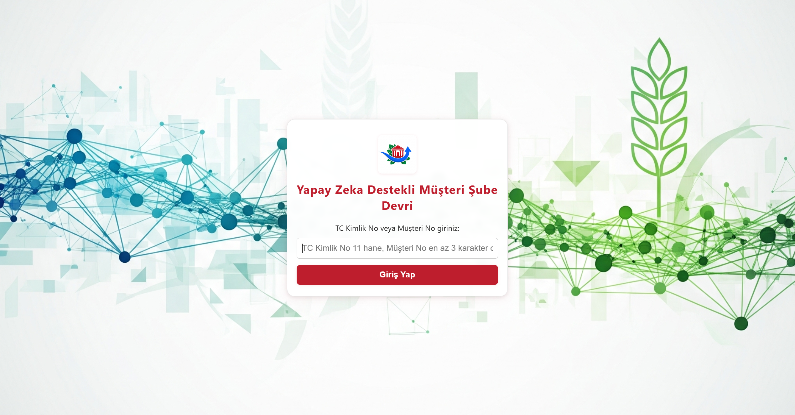
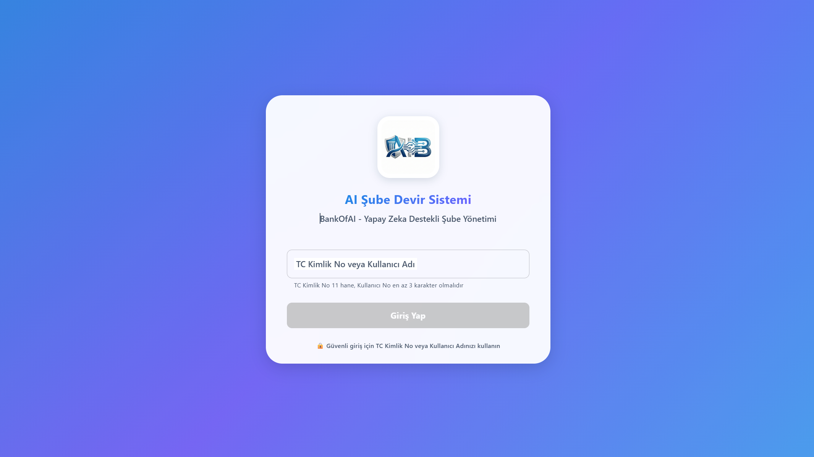
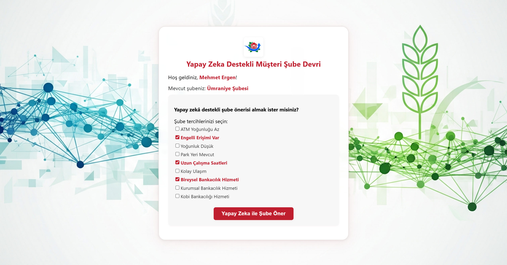
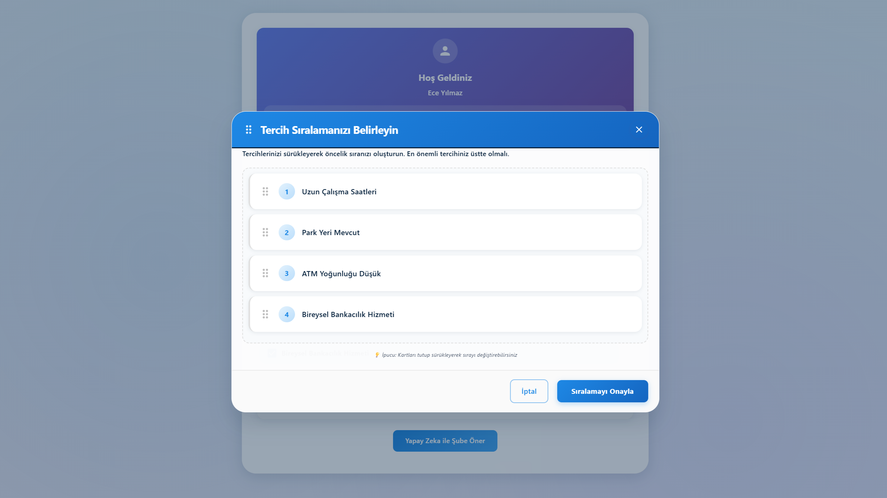
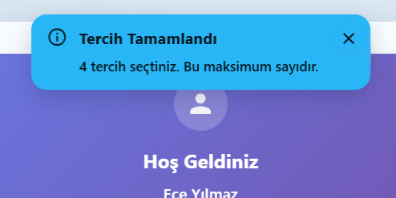

<div align="center">

# 🏦 Yapay Zeka Destekli Müşteri Şube Devir Sistemi

[](CHANGELOG.md)
[](https://reactjs.org/)
[](https://mui.com/)
[](LICENSE)
[](CONTRIBUTING.md)

**Yeni Nesil Bankacılık Arayüzü** | Yapay Zeka ile Şube Önerileri ve Premium Sürükle-Bırak Deneyimi

[🇬🇧 English](README.md) | [📖 Değişiklik Günlüğü](CHANGELOG.md) | [🐛 Hata Bildir](../../issues) | [✨ Özellik İste](../../issues)

</div>

---

## 🌟 Öne Çıkanlar

- 🧠 **Akıllı Yapay Zeka** - Mistral AI ve Gemini ile kişiselleştirilmiş şube eşleştirme
- ✨ **Premium Kullanıcı Deneyimi** - Material-UI bileşenleriyle glassmorphism tasarım
- ⚡ **React 18 Uyumlu** - Özel Strict Mode sarmalayıcı ile hatasız sürükle-bırak
- 🔔 **Akıllı Geri Bildirim** - Bağlam tabanlı Toast bildirim sistemi
- 🎨 **Bankacılık Teması** - Profesyonel mavi renk paleti (#1E88E5)
- 📱 **Tam Responsive** - Tüm ekran boyutları için optimize
- 🏗️ **Temiz Mimari** - Katmanlı tasarımla ölçeklenebilir backend

---

## 📸 Tasarım Evrimi

### Versiyon 2.0 vs 1.0 Karşılaştırması

<table>
<tr>
<th width="50%">Eski v1.0</th>
<th width="50%">Premium v2.0</th>
</tr>
<tr>
<td>

#### Giriş Ekranı


**Sorunlar:**
- ❌ Basit inline CSS
- ❌ Kırmızı renk şeması
- ❌ Animasyon yok
- ❌ Sınırlı responsive tasarım

</td>
<td>

#### Giriş Ekranı


**İyileştirmeler:**
- ✅ Material-UI bileşenleri
- ✅ Bankacılık mavisi teması
- ✅ Yumuşak animasyonlar
- ✅ Tam responsive

</td>
</tr>
<tr>
<td>

#### Tercih Sıralama


**Sorunlar:**
- ❌ Sürükleme offset hataları (React 18)
- ❌ Titrek animasyonlar
- ❌ Sade tasarım

</td>
<td>

#### Tercih Sıralama


**İyileştirmeler:**
- ✅ Piksel-mükemmel sürükle-bırak
- ✅ Glassmorphism efektleri
- ✅ Profesyonel cilalama

</td>
</tr>
<tr>
<td colspan="2" align="center">

#### Toast Bildirimleri (v2.0'da YENİ)


</td>
</tr>
</table>

---

## 🚀 Hızlı Başlangıç

### Gereksinimler

- **Node.js** 18+ ve npm
- **Git**
- **Mistral AI API Anahtarı** ([console.mistral.ai](https://console.mistral.ai) adresinden alabilirsiniz)

### Kurulum

```bash
# Depoyu klonlayın
git clone https://github.com/emregumusai/ai-branch-transfer-system.git
cd ai-branch-transfer-system

# Backend bağımlılıklarını yükleyin
cd AIMusteriSubeDevir/backend
npm install

# .env dosyası oluşturun ve API anahtarını ekleyin
echo "MISTRAL_API_KEY=api_anahtariniz_buraya" > .env

# Frontend bağımlılıklarını yükleyin
cd ../frontend
npm install
```

### Uygulamayı Çalıştırma

```bash
# Terminal 1: Backend'i başlatın (port 5000)
cd AIMusteriSubeDevir/backend
node app.js

# Terminal 2: Frontend'i başlatın (port 3001)
cd AIMusteriSubeDevir/frontend
$env:PORT=3001  # Windows PowerShell
# veya export PORT=3001  # Linux/Mac
npm start
```

Tarayıcınızda [http://localhost:3001](http://localhost:3001) adresini açın.

---

## 🛠️ Teknoloji Yığını

### Frontend
- **React** 19.1.0 - Strict Mode ile UI kütüphanesi
- **Material-UI** 7.3.8 - Bileşen kütüphanesi ve tasarım sistemi
- **Redux Toolkit** - State yönetimi
- **@hello-pangea/dnd** 18.0.1 - Sürükle-bırak işlevselliği
- **Emotion** - CSS-in-JS stillendirme
- **Axios** - HTTP istemcisi

### Backend
- **Node.js** + Express 5.1.0
- **Mistral AI** - Birincil AI sağlayıcı (Gemini yedekleme ile)
- **Clean Architecture** - Katmanlı tasarım deseni (controllers, services, repositories)
- **JSON Storage** - Dosya tabanlı veri kalıcılığı

### DevOps
- Git versiyon kontrolü
- Semantik versiyonlama (SemVer)
- Konvansiyonel commit'ler
- GitHub Issues & Projects
- Otomatik iş akışları

---

## 🎨 Mimari

### Bileşen Yapısı
```
src/
├── components/
│   ├── common/              # Yeniden kullanılabilir bileşenler
│   │   ├── Toast.js         # Bildirim sistemi
│   │   ├── Button.js
│   │   ├── Loading.js
│   │   └── ErrorAlert.js
│   ├── features/            # Özelliğe özel bileşenler
│   │   ├── LoginForm.js
│   │   ├── WelcomeScreen.js
│   │   ├── PreferenceSelector.js
│   │   ├── BranchSelectionOptions.js
│   │   ├── TercihSiralama.js
│   │   ├── AIRecommendationCard.js
│   │   ├── SuccessMessage.js
│   │   └── UserGreeting.js
│   └── ...
├── store/
│   └── slices/
│       ├── authSlice.js     # Redux auth state
│       ├── branchSlice.js
│       └── recommendationSlice.js
├── theme/
│   └── theme.js             # MUI tema konfigürasyonu
└── App.js                   # Kök bileşen
```

### Backend Mimarisi
```
backend/
├── src/
│   ├── config/              # Konfigürasyon dosyaları
│   ├── constants/           # Uygulama sabitleri
│   ├── controllers/         # İstek yöneticileri
│   ├── middlewares/         # Express middleware'leri
│   ├── repositories/        # Veri erişim katmanı
│   ├── routes/              # API rotaları
│   ├── services/
│   │   ├── ai/              # AI sağlayıcı servisleri
│   │   ├── branch/          # Şube mantığı
│   │   └── scoring/         # Puanlama algoritmaları
│   ├── utils/               # Yardımcı fonksiyonlar
│   └── validators/          # Girdi doğrulama
├── app.js                   # Ana sunucu dosyası
└── package.json
```

---

## 🔑 Önemli Teknik Kararlar

### React 18 Strict Mode Uyumluluğu
**Problem:** @hello-pangea/dnd, çift render nedeniyle koordinat hesaplama sorunları yaşadı.

**Çözüm:**
```javascript
// requestAnimationFrame ile özel sarmalayıcı
const StrictModeDroppable = ({ children, ...props }) => {
    const [enabled, setEnabled] = useState(false);
    
    useEffect(() => {
        const frame = requestAnimationFrame(() => setEnabled(true));
        return () => cancelAnimationFrame(frame);
    }, []);
    
    if (!enabled) return null;
    return <Droppable {...props}>{children}</Droppable>;
};
```

### Toast Bildirim Sistemi
**Değiştirilen:** Statik Alert bileşenleri  
**Yerine:** Bağlam tabanlı provider deseni

```javascript
// Uygulamanın herhangi bir yerinde kullanım
const { showToast } = useToast();
showToast('Devir başarılı!', 'success');
```

### Material-UI Temalaması
**Merkezileştirilmiş** renk paleti ve bileşen geçersiz kılmaları:
```javascript
// theme.js
export const theme = createTheme({
  palette: {
    primary: { main: '#1E88E5' },      // Bankacılık mavisi
    secondary: { main: '#6C63FF' },    // Mor vurgu
    success: { main: '#00D395' },      // Başarı yeşili
  },
  // ... bileşen geçersiz kılmaları
});
```

---

## 📚 Dokümantasyon

- [📋 **Değişiklik Günlüğü**](CHANGELOG.md) - Versiyon geçmişi ve sürüm notları
- [🤝 **Katkıda Bulunma**](CONTRIBUTING.md) - Projeye nasıl katkıda bulunulur
- [🇬🇧 **İngilizce README**](README.md) - English documentation
- [🐛 **Bilinen Sorunlar**](../../issues?q=is%3Aissue+is%3Aopen+label%3Abug) - Mevcut hatalar ve sınırlamalar
- [✨ **Özellik İstekleri**](../../issues?q=is%3Aissue+is%3Aopen+label%3Aenhancement) - Planlanan özellikler

---

## 🗺️ Yol Haritası

### ✅ Tamamlanan (v2.0)
- [x] Material-UI geçişi
- [x] Bankacılık profesyonel teması
- [x] Toast bildirim sistemi
- [x] React 18 sürükle-bırak düzeltmesi (StrictModeDroppable)
- [x] Glassmorphism UI efektleri
- [x] Backend'de Clean Architecture
- [x] Redux Toolkit state yönetimi

### 🚧 Devam Eden (v2.1)
- [ ] Karanlık mod desteği
- [ ] Erişilebilirlik denetimi (WCAG AAA)
- [ ] Performans optimizasyonları (kod bölme, lazy loading)
- [ ] Unit test kapsamı

### 📋 Planlanan (v3.0)
- [ ] Çoklu dil desteği (i18n)
- [ ] Gelişmiş AI model seçimi (GPT-4, Claude)
- [ ] Şube konum haritası entegrasyonu (Google Maps API)
- [ ] Gerçek zamanlı analitik panosu
- [ ] Mobil uygulama (React Native)
- [ ] Docker konteynerizasyonu
- [ ] CI/CD pipeline

---

## 🤝 Katkıda Bulunma

Katkılarınızı bekliyoruz! Lütfen yönergeler için [CONTRIBUTING.md](CONTRIBUTING.md) dosyasına bakın.

### Hızlı Katkı Rehberi

1. Depoyu fork edin
2. Özellik dalı oluşturun (`git checkout -b feature/harika-ozellik`)
3. Değişiklikleri commit edin (`git commit -m 'feat: harika özellik eklendi'`)
4. Dala push edin (`git push origin feature/harika-ozellik`)
5. Pull Request açın

### Commit Kuralları

[Conventional Commits](https://www.conventionalcommits.org/) takip ediyoruz:

```
feat: Yeni özellik
fix: Hata düzeltmesi
docs: Dokümantasyon
style: Biçimlendirme
refactor: Kod yeniden yapılandırma
test: Testler
chore: Bakım
```

---

## 📄 Lisans

MIT License - detaylar için [LICENSE](LICENSE) dosyasına bakın.

### 🎓 Ücretsiz Kullanım
- Kişisel projeler
- Eğitim amaçlı
- Akademik araştırma
- Ticari olmayan uygulamalar

### 💼 Ticari Kullanım
- Lisanslama seçenekleri için iletişime geçin
- Kurumsal destek mevcut

---

## 👤 Yazar

**Emre Gumus**
- GitHub: [@emregumusai](https://github.com/emregumusai)
- Repository: [ai-branch-transfer-system](https://github.com/emregumusai/ai-branch-transfer-system)

---

## 🙏 Teşekkürler

- Mükemmel bileşen kütüphanesi için Material-UI ekibi
- React 18 uyumlu sürükle-bırak için @hello-pangea/dnd geliştiricileri
- Güçlü dil modelleri için Mistral AI
- Açık kaynak topluluğu

---

<div align="center">

**⭐ Faydalı bulduysanız bu depoyu yıldızlayın!**

[Hata Bildir](../../issues/new?template=bug_report.yml) · [Özellik İste](../../issues/new?template=feature_request.yml) · [Değişiklik Günlüğü](CHANGELOG.md)

Bankacılık sektörü için ❤️ ile yapıldı

</div>
